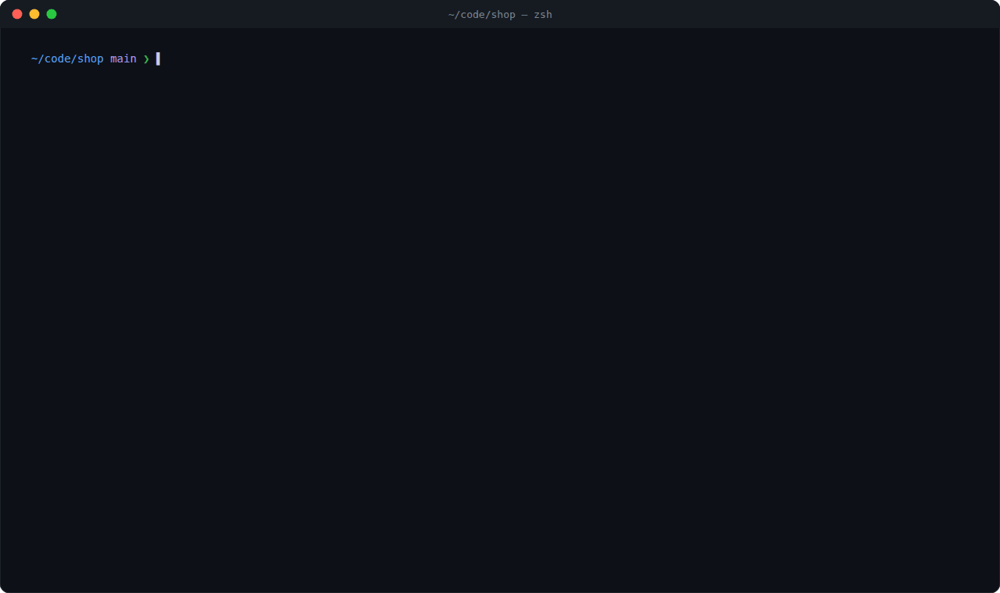

<div align="center">

```text
               __
   _________  / /_____ _
  / ___/ __ \/ __/ __ `/
 / /  / /_/ / /_/ /_/ /
/_/   \____/\__/\__,_/
```

# rota

**Turn Claude Code or Codex into a small dev team. You write the issues; an orchestrator agent hands them to worker agents, merges their PRs and checks every merge against your tests.**

[](https://github.com/l4ci/rota/releases)
[](LICENSE)
[](https://github.com/l4ci/rota/commits)
[](https://github.com/l4ci/rota/stargazers)
[](https://claude.com/claude-code)
[](https://developers.openai.com/codex)
[](#runs-in-herdr-or-tmux)

[How it works](#how-it-works) · [herdr and tmux](#runs-in-herdr-or-tmux) · [Accounts](#several-accounts-balanced) · [Quick start](#quick-start) · [Skills](#skills) · [Docs](docs/)

</div>

<p align="center"></p>
<p align="center"><sub>A round in herdr's split view (illustration with a sample project; the palette is rota's real first screen).</sub></p>

---

## How it works

rota has two parts: **skills**, slash commands like `/rota-work` that tell the agent how to do a job well, and the **`rota` CLI**, which the skills call to do the bookkeeping and enforce the rules (who holds which issue, what may merge).

You can use it two ways. Start with the first; move to the second when you have several issues ready at once.

**1. One agent, one item at a time.** You stay in the conversation.

```text
/rota-capture  →  /rota-work  →  /rota-ship
 write it down     build it      review, then PR or merge
```

**2. A round: several agents in parallel.** You stay available for questions.

```text
                        ┌─► worker ben  ─► PR ─┐
issues ─► orchestrator ─┼─► worker dana ─► PR ─┼─► gate ─► main
                        └─► worker nia  ─► PR ─┘
```

- **Orchestrator**: one agent that picks the next issues, hands them out, answers workers' questions, and merges. It asks you only for product decisions.
- **Workers**: agents that each take one issue in their own git worktree and terminal tab, build it, and open a PR. They never merge.
- **Gate**: the only merge path. It checks the PR is current and properly signed off, merges it, then runs your full test suite on the merged `main`. A red result stops the round until it's fixed. With `test.fullWhere ci` the suite runs in CI before the merge instead.

Both ways share a memory in `.rota/`: what the project has learned (`KNOWLEDGE.md`), the lines it must not cross (`DECISIONS.md`), and handoff notes, so a fresh session picks up where the last one stopped.

## Runs in herdr or tmux

A round runs in your terminal, not in a cloud dashboard. Start the orchestrator inside [herdr](https://herdr.dev) or [tmux](https://github.com/tmux/tmux) and rota gives every worker its own tab (tmux: window), so you can watch any agent, or type into one, at any time.

- **herdr** reports each agent's state directly (working, blocked, done), and rota waits on those events instead of polling.
- **tmux** works too: rota reads the panes to tell what each worker is doing.
- **Neither?** The round still runs, with workers as subagents of the orchestrator.

Workers can be Claude Code or Codex, mixed in one round: a `harness:codex` label, or `round.workerKind`, picks per issue or per project.

## Several accounts, balanced

Long rounds run into usage limits. List your accounts and rota spreads the work and routes around limits:

- **Load balancing.** With several Claude accounts in `work.accounts`, `rota round assign` puts new work on the account with the most headroom and skips one that is cooling down.
- **Limits.** When a worker hits a limit, `rota limit watch` moves its issue to a free slot on another account, continuing from the pushed branch, or waits for the reset if none is free.
- **The orchestrator** can hand off and restart under another account before it hits its own limit (`orchestrator.switchOnUsage`), and `rota keepalive` restarts it if it stops.
- **Codex.** `work.codexAccounts` spreads Codex workers over several logins (rota can't read Codex usage, so these aren't balanced by headroom).

Setup: [parallel rounds](docs/usage/parallel-rounds.md#setup) and [unattended rounds](docs/usage/unattended-rounds.md).

## Quick start

You need git and [Claude Code](https://claude.com/claude-code) or Codex. The install script also needs `minisign`. For rounds you'll later want `gh` (or `glab`) and [herdr](https://herdr.dev) or tmux.

```bash
curl -fsSL https://raw.githubusercontent.com/l4ci/rota/main/install.sh | sh   # or: brew install l4ci/tap/rota
rota skills install     # adds the /rota-* skills to Claude Code and Codex
cd your-project && rota init
```

`rota init` creates `.rota/` with sensible defaults. Commit it. Then, in Claude Code:

```text
/rota-capture fix the login redirect loop; add a dark mode toggle
/rota-work      # picks the next item, plans it, builds it in small commits
/rota-ship      # reviews the branch, then opens a PR or merges
```

That's the whole loop. [Getting started](docs/getting-started.md) walks through it with the choices `rota init` makes. When you have a few independent issues, [your first round](docs/first-round.md) sets up the orchestrator and workers.

## Skills

In the order you'd usually reach for them:

| When | Skill | What it does |
|---|---|---|
| Something to do | `/rota-capture` | Turn a brain dump into backlog items or issues |
| Not sure how | `/rota-brainstorm`, `/rota-spike` | Explore designs; try a risky idea on a throwaway branch |
| Ready to build | `/rota-plan`, `/rota-work` | Plan a bigger item; build the next one |
| Something broke | `/rota-debug` | Reproduce, find the cause, fix it |
| Done | `/rota-review`, `/rota-ship` | Review the branch; open the PR or merge |
| Many issues at once | `/rota-orchestrate` | Run a round with parallel workers |
| Worth remembering | `/rota-learn`, `/rota-decide` | Save a lesson; lock in a rule |
| Out of context | `/rota-pause` | Write a handoff so a fresh session continues |
| Bigger picture | `/rota-vision`, `/rota-refactor`, `/rota-qa`, `/rota-release` | Milestones, architecture review, product QA, releases |

Every skill: [slash commands](docs/reference/slash-commands.md). Settings: [configuration](docs/usage/configuration.md).

## Docs

- [Getting started](docs/getting-started.md): install and your first item, end to end
- [Your first round](docs/first-round.md): orchestrator, workers and the gate, step by step
- [How it works](docs/how-it-works.md): every skill, file and verb, and how they connect
- [FAQ](docs/faq.md) · [Cheatsheet](docs/cheatsheet.md) · [All docs](docs/)

## Contributing

Issues and PRs welcome. Run `python3 test/validate-skills.py`, `bash test/doclint.sh` and `bash test/smoke.sh` before a PR; add a smoke assertion when you touch a verb. Running a round on rota itself: [contributing: rounds](docs/contributing/rounds.md).

## License

[MIT](LICENSE)
