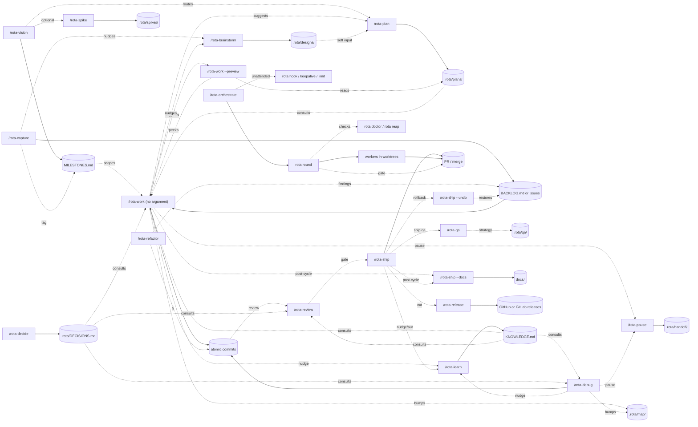

# How rota works

rota is a CLI plus a set of skills (slash commands in Claude Code). Together they form a loop: capture, plan, execute with atomic commits, ship behind a review gate, persist the lessons.

## Two ways to use it

**One agent, one item at a time.** You stay in the conversation: `/rota-capture` writes the work down, `/rota-work` builds it, `/rota-ship` reviews it and opens a PR or merges. Start here.

**A round: several agents in parallel.** For several independent issues, `/rota-orchestrate` starts a round with three roles:

- **Orchestrator**: one agent that picks the next issues, hands them out, answers workers' questions and merges.
- **Workers**: agents that each take one issue in their own git worktree, build it and open a PR. They never merge.
- **Gate** (`rota worker gate`): the only merge path. It checks the PR is current and properly signed off, runs your full test suite (`test.full`) on a scratch merge of it, then merges on a pass.

Both ways share a memory in `.rota/`: knowledge, decisions and handoff notes.

## The detailed map

The diagram below shows how every skill connects to the artifacts it reads or writes, and which skills nudge or consult each other.

Almost everything Claude reads or mutates lives under `.rota/` in your project; with `backlog.backend: "issues"` the backlog lives on the GitHub/GitLab tracker instead. Git is the source of truth; `status.json` is just a cache, and `/rota-work` with no argument reconciles drift between the two.

## The seven lanes

**Capture.** `/rota-capture` is the brain-dump entry point. It splits, classifies, and creates the items with `rota item create`, on whichever backend `backlog.backend` selects: `.rota/BACKLOG.md` with IDs `B01`, `F01`, `T01` (`file`, the default), or GitHub/GitLab issues with IDs `#N` (`issues`). See the [issue backend](usage/issue-backend.md). `/rota-capture` prints the new IDs and stops; `/rota-work` picks them up. Import (`--from-github` / `--from-gitlab`) was removed: under `backlog.backend: "issues"` the issues already are the backlog. `/rota-capture --remove <ID>` is the local inverse: it strips a captured item and cleans up its dependencies behind a dry-run preview and confirmation gate.

**Plan.** `/rota-vision` brainstorms milestones with Socratic discovery, web research, and a deliberate critique pass. `/rota-brainstorm` explores design for size-Major features or P0 bugs before planning. `/rota-plan` writes the implementation plan to its own file, keyed by milestone slice or item. `/rota-spike` runs throwaway feasibility experiments on a branch that never merges; only findings come back. `/rota-work --preview <ID>` previews the orchestrator's intended approach without writing anything, a cheap gate before code lands on high-stakes items.

**Execute.** `/rota-work` is the orchestrator. It reads the plan (or decomposes ad-hoc if none exists), dispatches worker subagents in parallel, commits one verifiable task at a time. `/rota-debug` runs a systematic reproduce → hypothesize → verify → fix cycle for bugs. `/rota-refactor` reviews the architecture and files findings as `refactor` issues; `--fix` implements the ones you pick. `/rota-pause` writes a handoff note when the context window is filling, so a fresh `/rota-work` (no argument) session picks up cleanly.

**Ship.** `/rota-review` runs two parallel reviewers over the branch and reports them separately: Spec (intent match against the item's spec, the issue body in issue mode, plus drift and `DECISIONS.md` violations) and Standards (`KNOWLEDGE.md` conventions, a code-smell baseline, tautological and implementation-coupled tests, the silent-failure-hunter rubric). It returns `PASS` / `CONCERNS` / `FAIL`, the worse of the two. `/rota-qa` answers the orthogonal question, *"does the product actually work?"*, by running per-target strategies (`.rota/qa/<target>.md`) with Playwright / smoke / lighthouse / axe / ZAP / contract runners. `/rota-ship` builds an ID-linked PR body or direct-merges based on configured strategy (the issue backend always uses a PR), with two opt-in gates layered after `/rota-review`: a fresh-eyes second-opinion review (`ship.secondOpinion`) and a product QA run (`ship.qa`). `/rota-ship --undo` rolls back the last direct-merge cycle in one operation, restoring the backlog items.

**Persist.** `/rota-learn` writes durable session learnings to `KNOWLEDGE.md`, with an optional Opus verification pass (`--strict` or `learn.verify`). That includes domain terms via the `--term <name>` flag, which lands the term as a nested-bullet entry under the pinned `## Glossary` topic of the same file. `/rota-decide` captures hard-boundary commitments to `DECISIONS.md` with explicit forbids and permits. The project map (`.rota/map/<name>.md` files describing subsystems) is hand-authored; cycle skills (`/rota-work`, `/rota-debug`) bump `touched:` post-cycle on matched subsystems and regenerate the always-on `## Project Map` block via `rota map index`. `/rota-ship --docs` keeps the public docs in sync with the code (inline at ship time or via the manual `--docs` flag).

**Rounds.** `/rota-orchestrate` runs a parallel round. The `rota round` verbs do the mechanics: take the orchestrator lease, assign issues, wait for workers, wind down. Each worker is an agent in its own git worktree (`rota worker` manages slots, hosts and accounts) that implements one issue and opens a PR; the orchestrator runs the gate and merges. `rota agents write` (run by `rota init`) writes the subagent definitions workers use. For a hard issue, the label `best-of:2` gives it to two workers at once, and `rota round pick` names the attempt that may merge. The gate refuses an empty `test.full` (unless `--no-verify`), a PR body without `Closes #N` (unless the issue is `partial-slice`), a recorded FAIL verdict and an unpicked best-of attempt. A slot is free as soon as its PR is open, so the next issue starts while the PR waits for review. `rota doctor` checks the machine first and `rota reap` clears leftovers. For unattended runs, `rota hook`, `rota statusline`, `rota keepalive` and `rota limit` hand the orchestrator off before its context fills, restart it and wait out usage limits. See [parallel rounds](usage/parallel-rounds.md) and [unattended rounds](usage/unattended-rounds.md).

**Maintenance.** `rota init` sets up `.rota/` once at the project root (`rota setup` adds a config walkthrough; bare `rota` runs it in an uninitialized project and launches the orchestrator in an initialized one). `rota config set` edits config (never hand-edit JSON). `rota update` checks for newer rota releases and prints the exact upgrade command. `rota skills` installs and refreshes the skills from the binary. `rota doctor` checks git, the forge, accounts and installed skills. `/rota-release` cuts your project's own releases: version bump, categorized notes, tag, push, GitHub/GitLab release.

For the alphabetical reference of every skill see [the slash commands page](reference/slash-commands.md). For two worked examples that carry one concrete project end-to-end, see the [walkthroughs](walkthroughs/).
