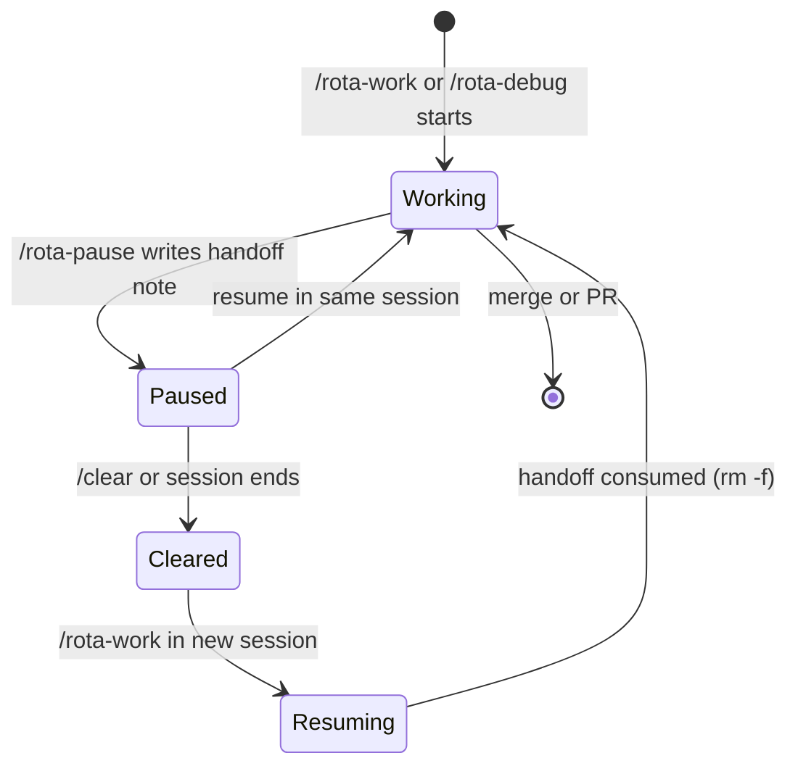

# Pausing and resuming

Long sessions hit `/clear` or get interrupted. `/rota-pause` writes what was in your head before you leave, and [`/rota-work` (no argument)](picking-work.md) picks it back up when you return.

## /rota-pause

`/rota-pause` captures the live state of a mid-session investigation into `.rota/handoff/<branch>.md` before you stop. Git commits carry code. The handoff note carries intent: current hypothesis, next planned step, files that are mid-edit, and gotchas you ran into along the way.

**Use it when:**

- Your context window is filling and a `/clear` is coming.
- You're stepping away mid-[`/rota-work`](running-work.md) or mid-debug without a clean stopping point.
- A long investigation needs to survive a session boundary.

**What happens:** the skill resolves the active branch, asks how you want to handle uncommitted work (wip commit, stash, or leave dirty), then writes the handoff note. One note per branch; re-pausing overwrites the previous one.

The note's shape:

```
## Working on
## Next planned step
## Current hypothesis (if debugging)
## Uncommitted work
```

Sections that don't apply are omitted. `Working on` holds the items, milestone and stage. Gotchas and dead ends belong in [`/rota-learn`](learning.md), not the note.

You don't need to manage this file directly. `/rota-work` (no argument) reads and deletes it on resolve.



## /rota-work reads handoff notes

When active streams exist, `/rota-work` (no argument) reads any handoff note matching each stream and surfaces the **Stage**, **Next planned step**, and **Current hypothesis** inline. Path resolution mirrors `/rota-pause`'s write side: `.rota/handoff/<branch>@<repo>.md` for umbrella streams, with a fallback to `.rota/handoff/<branch>.md` for single-repo cycles or pre-umbrella handoffs.

If a handoff is present, `/rota-work` (no argument)'s per-stream question offers "Resume with `/rota-work`" as the recommended action. The handoff brief flows into the dispatched `/rota-work`, and the note is `rm -f`-ed once the user confirms the resume. "Leave handoff for later" preserves the file so the next `/rota-work` (no argument) invocation surfaces it again.

## Recovering after /clear

A typical recovery looks like this:

1. You're mid-investigation on branch `rota/my-feature`, context is filling. You run `/rota-pause`, which writes `.rota/handoff/rota/my-feature.md` with your current hypothesis and the next step you were about to try.
2. You run `/clear`. All conversation context is gone.
3. In the new session, you run `/rota-work` (no argument).
4. The skill reads `status.json`, validates active streams against git, finds the handoff note for `rota/my-feature`, and surfaces something like:

```
Active streams
  rota/my-feature  (3 commits)  mid-implementation

Handoff note found:
  Next planned step: add the retry path in src/worker.ts
  Current hypothesis: the timeout is in the fetch wrapper, not the caller

→ Resuming /rota-work with handoff brief
```

5. You confirm, and `/rota-work` picks up with the handoff note as its brief. The note is deleted.

## When to /rota-pause vs just commit and walk away

A clean commit is enough when the work sits at a natural stopping point: a passing test, a completed subtask, a checkpoint that git state alone can describe. `/rota-pause` is for the messy middle. The live hypothesis, the half-written test, the "I was about to try X": none of that survives a `/clear` from git state alone. If you'd have to re-read diffs and reconstruct your reasoning to figure out what to do next, pause first.

## Orchestrator handoff

`/rota-pause` also works for an orchestrator mid-round. It records the round (slots, PRs awaiting review) in `.rota/handoff/<base>.md` and leaves the round running; it never winds it down.

A round's orchestrator hands off before its context fills, through a `Stop` and a `SessionStart` hook
that `rota hook install` writes. That moved to [unattended rounds](unattended-rounds.md#orchestrator-handoff).
For a handoff you write yourself, use `/rota-pause` above.

## Keepalive

`rota keepalive run` starts the next orchestrator session after a handoff exit. See
[unattended rounds](unattended-rounds.md#-keepalive).

## Usage limits

`rota limit watch` waits out a 5-hour or weekly limit and types the resume prompt. See
[unattended rounds](unattended-rounds.md#-usage-limits).

## Switching the orchestrator's account

Opt-in: with `orchestrator.switchOnUsage` the orchestrator restarts under another account before a
limit. See [unattended rounds](unattended-rounds.md#switching-the-orchestrators-account).
