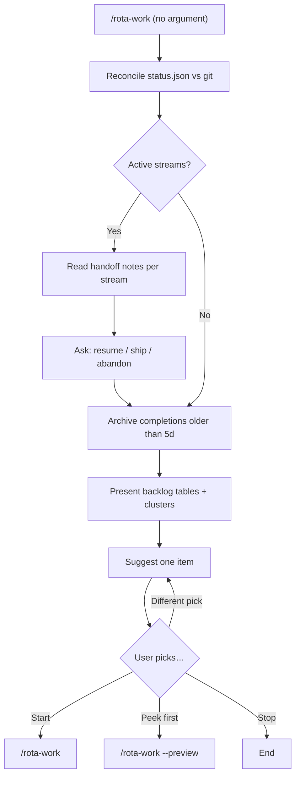

# Picking work

Two flows help you orient and pick what to do next. `/rota-work` (no argument) reconciles git state, surfaces any [`/rota-pause`](pausing-and-resuming.md) handoff note for active streams, presents the backlog (`.rota/BACKLOG.md`, or the tracker's issues on the [issue backend](issue-backend.md)), and suggests work. `/rota-work --preview <ID>` lets you peek at the orchestrator's plan before code lands.

## /rota-work (no argument)

Reconciles the backlog against actual git state, then suggests what to pick up.

Before presenting results it:

1. Validates active branches and worktrees against git; stale entries get cleaned automatically.
2. Archives completions older than five days to `ARCHIVE.md` (file backend only; issues are closed on the tracker).
3. Shows the backlog sorted by priority and size, with a clusters section built from `Related:` links.
4. Suggests one item. P0 bugs jump the queue.



After you confirm the pick, `/rota-work` (no argument) routes you to [running work](running-work.md) via `/rota-work`.

**Example:**

```
/rota-work
```

Output: the backlog table plus a suggestion, e.g. `Suggested next: B03 Fix auth token expiry (P0)` and one sentence why (`#42` instead of `B03` on the issue backend). Answer `y` (or pick a different item) and work begins.

If the suggestion is a size-Major feature or a P0/P1 bug, `/rota-work` (no argument) offers `/rota-work --preview` as a question option before routing to `/rota-work`.

Items with a `Related:` field that share a cluster are listed together in the clusters section. The suggestion is a single item; to take a cluster as a batch, answer "Pick different items" and choose the set.

## /rota-work --preview: peek before you commit

Prints the orchestrator's intended approach for an item before any code is written. Read-only: no writes, no commits.

Output structure:

- One-paragraph approach summary
- Bulleted lists: *Files I'd touch*, *Files I'd create*, *Hard boundaries to respect* (when a `DECISIONS.md` topic matches), *Tests I'd add*, *Assumptions I'm making*, *Known unknowns*

Use it as a cheap gate before `/rota-work` on size-Major-or-larger items or P0/P1 bugs, where corrections after the fact are expensive. Review the output, then push back, ask for a durable plan ([`/rota-plan`](vision-and-plans.md)), or proceed to [running work](running-work.md) by re-invoking `/rota-work` without the flag.

**Example:**

```
/rota-work --preview F08
```

Output: specific file paths, test names, and function names the orchestrator would touch, not generic descriptions.

If a plan already exists (file backend: [`.rota/plans/<key>.md`](../reference/rota-folder.md); issue backend: a note on the issue), the peek restates it. Without a plan, the output is an ad-hoc decomposition; reach for `/rota-plan` when alignment needs to survive beyond the current session.

## How reconciliation keeps state honest

The status cache is a speed optimisation; git is the source of truth. Each `/rota-work` (no argument) run checks which branches and worktrees actually exist: deleted branches become stale entries and get cleaned up, removed worktrees get updated in kind. If state drifts (crashed session, manual git operations), the next `/rota-work` (no argument) run repairs it without manual intervention.
