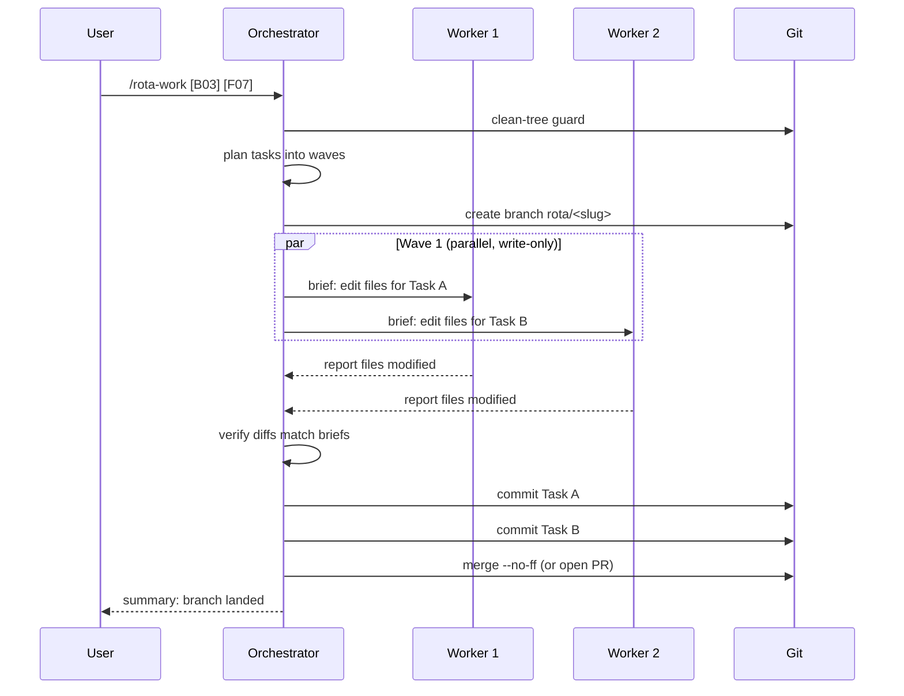

# Implementing

Items captured in [`BACKLOG.md`](../reference/rota-folder.md) reach "merged" through `/rota-work`, an orchestrator that plans, dispatches parallel workers, and lands one atomic commit per task. For a single ad-hoc fix, run `/rota-capture`, then `/rota-work <ID>`.

## /rota-work

`/rota-work` is the main implementation driver. The orchestrator plans tasks, dispatches workers in parallel (one per task), verifies each result, then either merges to main or opens a PR based on your `work.mergeStrategy`.

**Trigger phrases:**

- `/rota-work` with no argument reconciles the backlog, suggests an item, then works it
- `/rota-work [B03]` to implement a specific item by ID
- `/rota-work [B03] [F07]` to implement a batch of items together
- `/rota-work "add retry logic to the upload pipeline"` describes the work; it captures and executes

**Precondition:** refuses to start on a dirty working tree. Commit or stash first.

**Status tracking:** registers in `.rota/status.json` at start so [`/rota-work` (no argument)](picking-work.md) in another session knows those items are in progress.



## One commit per task

Each task lands as its own atomic commit. One item, one commit, tagged with the item ID:

```
a1b2c3d fix: retry logic on network timeout [B03]
d4e5f6a feat: per-project theme support [F07]
g7h8i9j task: update CI to Node 20 [T02]
```

That keeps reverts surgical (drop one task without touching others), makes PR review easier (read commit by commit), and leaves a predictable history `/rota-ship` reads to build PR bodies automatically.

## Isolation: branch vs. worktree

Set `work.isolation` in [`config.json`](configuration.md):

| Mode | How it works | When to use |
|------|-------------|-------------|
| `"branch"` (default) | Feature branch in the current worktree | Solo work, simple workflows |
| `"worktree"` | Isolated directory under `.claude/worktrees/` | Parallel sessions, keep main clean while agents work |

With `"branch"`, your main worktree switches to the feature branch for the duration of the run. With `"worktree"`, the main worktree stays on `main`, so you can keep editing there while agents work in isolation.

To run multiple `/rota-work` sessions at the same time on different item batches, pick `"worktree"`. See [parallel-work](parallel-work.md) for the multi-session pattern.

## Capture, then work

For a single ad-hoc fix, run `/rota-capture` and then `/rota-work` on the printed ID.

```
/rota-capture "fix the off-by-one in RingBuffer"
/rota-capture "add a Cmd+K shortcut to the project picker"
```

The item gets a real ID (`#N` on the issue backend, `[B07]` on the file backend). Capture prints the ID and stops; it never starts work. If the scope is fuzzy, refine the item before running `/rota-work <ID>`.

**Flow:** `/rota-capture` files the item, `/rota-work <ID>` implements it. All `/rota-capture` rules (classification, detail-file overflow, ID assignment) and all `/rota-work` rules (clean-tree guard, branch/worktree isolation, parallel workers, per-task commits) apply.

## Capture vs. Work: picking the right entry

Pick by **intent**, not by the verb typed:

| The user wants to… | Use | Why |
|---------------------|-----|-----|
| Brain-dump items into the backlog without acting now | `/rota-capture` | Records only; no execution, no clean-tree guard |
| Get one specific thing done right now (not yet captured) | `/rota-capture`, then `/rota-work <ID>` | Capture records only; work is a separate step |
| Implement an item that's already in the backlog | `/rota-work <ID>` | Plans, dispatches workers, verifies, commits per task |
| Pick the next thing from the backlog and execute | `/rota-work` (no argument) | Reconciles, suggests, then works the pick |

**Rules of thumb:**

- *"fix X"* / *"add Y"* / *"do Z"*: clear single thing, not yet captured: `/rota-capture`, then `/rota-work <ID>`.
- A list of things, no immediate action, *"capture this"* / *"add to backlog"*: `/rota-capture`.
- Reference to an existing `[B##]`/`[F##]`/`[T##]` plus *"implement"* / *"build"* / *"do this one"*: `/rota-work <ID>`.
- *"what's next?"* / *"pick something"* / *"what should I work on?"*: `/rota-work` with no argument.

When intent is ambiguous, `/rota-capture` is the cheapest path: it only records, so nothing runs until you say so.

See [capturing work](capturing-work.md) for capture details and [picking work](picking-work.md) for how the no-argument `/rota-work` selects and prioritizes.

## Merge or PR

After `/rota-work` finishes, `work.mergeStrategy` in `config.json` controls what happens next:

| Strategy | Behavior |
|----------|----------|
| `"direct"` (default) | Merges the branch to main with `--no-ff`, deletes the branch |
| `"pr"` | Pushes the branch and creates a GitHub PR with a summary |

The actual ship-time gates (review, preflight, PR body composition) live in [review and ship](review-and-ship.md).

## Many items at once

`/rota-work` takes items one session at a time, with subagents inside that session. To run several issues in parallel, each worker in its own worktree and terminal tab, use a round: run `rota doctor`, then ask for `/rota-orchestrate`. See [parallel rounds](parallel-rounds.md), the [`rota round` verbs](../reference/cli-helpers.md#rota-round) and [`/rota-orchestrate`](../reference/slash-commands.md#rota-orchestrate).
